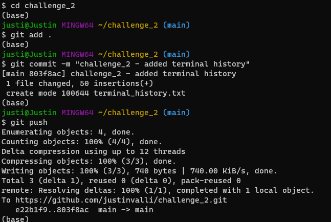
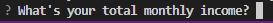

# Loan Qualifier Application

The Loan Qualifier Application was designed to help loan applicants determine which loans they qualify for based on multiple criteria, such as: (1) credit score, (2) loan size, (3) debt-to-income ratio, and (4) loan-to-value ratio.

After inputting the information, the user then is given the option to download the list of qualifying loans to a .csv file displaying the loans and their correspoding interest rates. 

---

## Technologies

This applicaiton is written in Python and requires the installation of the following libraries:

import sys
import fire
import questionary
import csv  
from pathlib import Path

---

## Installation Guide

1. Clone the repository to your local machine.

2. Install the required dependencies by running the following command:

pip install fire questionary csv pathlib

---

## Usage

1. Run the application by executing the following command:

python app.py

2. Enter the required information prompted by the program as demonstrated below.

3. The application will output any qualifying loans based on the entered information. If there are any qualifying loans, the user can choose to save them to a CSV file.

---

## Contributors

Justin Valli
https://www.linkedin.com/feed/

---

## License

This project is licensed under the MIT License. 
